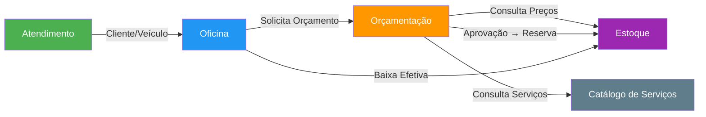
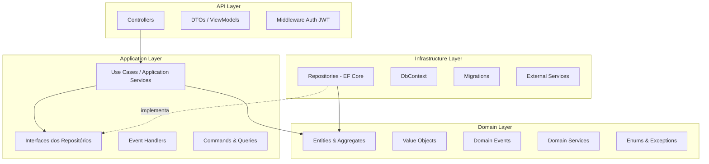
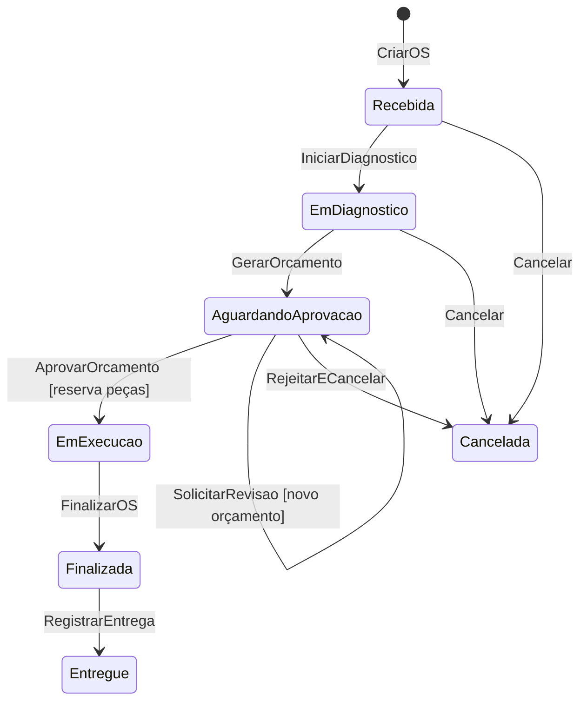

# Implementation Plan — Bloco 1: Modelagem DDD + Event Storming

## Problem Statement

Modelar o domínio de um sistema de oficina mecânica (criação/acompanhamento de OS + gestão de peças/insumos) usando DDD e Event Storming, antes de escrever qualquer código em C#. O resultado será a base conceitual para toda a implementação.

## Requirements

- Grupo iniciante em DDD — material precisa ser didático
- Stack: C# (.NET)
- Abordagem granular: 4-5 Bounded Contexts
- Um mecânico por OS
- Orçamento com possibilidade de rejeição + renegociação OU cancelamento
- Reserva de peças no estoque apenas na aprovação do orçamento (cliente informado)
- Entregável: board no Miro + documentação textual

---

## 1. Bounded Contexts + Context Map

### Bounded Contexts identificados:

| # | Bounded Context | Responsabilidade |
|---|----------------|-----------------|
| 1 | Atendimento | Cadastro de clientes e veículos, recepção do veículo |
| 2 | Oficina | Ordem de Serviço, diagnóstico, execução, máquina de estados |
| 3 | Orçamentação | Geração de orçamento, aprovação/rejeição/renegociação |
| 4 | Estoque | Catálogo de peças/insumos, controle de quantidade, reserva |
| 5 | Catálogo de Serviços | Tipos de serviço oferecidos, tempo estimado, preço base |

### Context Map (relações entre contextos):



### Tipos de relação:

| Upstream | Downstream | Relação |
|----------|-----------|---------|
| Atendimento | Oficina | Customer-Supplier (Atendimento fornece dados de cliente/veículo) |
| Oficina | Orçamentação | Customer-Supplier (Oficina solicita orçamento) |
| Estoque | Orçamentação | Conformist (Orçamentação consulta preços do Estoque) |
| Catálogo de Serviços | Orçamentação | Conformist (Orçamentação consulta valores do Catálogo) |
| Orçamentação | Estoque | Customer-Supplier (Aprovação dispara reserva) |

---

## 2. Event Storming

### Fluxo 1: Criação e Acompanhamento da Ordem de Serviço

#### Eventos de Domínio (post-its laranja):

1. ClienteCadastrado
2. VeiculoCadastrado
3. VeiculoRecebido
4. OrdemDeServicoCriada
5. DiagnosticoRealizado
6. OrcamentoGerado
7. OrcamentoEnviadoParaCliente
8. OrcamentoAprovado
9. OrcamentoRejeitado
10. OrcamentoRevisado (renegociação)
11. OrdemDeServicoCancelada
12. ExecucaoIniciada
13. ServicoExecutado
14. OrdemDeServicoFinalizada
15. VeiculoEntregue

#### Comandos (post-its azul):

1. CadastrarCliente
2. CadastrarVeiculo
3. ReceberVeiculo
4. CriarOrdemDeServico
5. RegistrarDiagnostico
6. GerarOrcamento
7. EnviarOrcamentoParaCliente
8. AprovarOrcamento
9. RejeitarOrcamento
10. SolicitarRevisaoDeOrcamento
11. CancelarOrdemDeServico
12. IniciarExecucao
13. RegistrarServicoExecutado
14. FinalizarOrdemDeServico
15. RegistrarEntregaVeiculo

#### Agregados (post-its amarelo):

- Cliente (Atendimento)
- Veiculo (Atendimento)
- OrdemDeServico (Oficina)
- Orcamento (Orçamentação)
- Peca (Estoque)
- Servico (Catálogo de Serviços)

#### Políticas / Regras de Negócio (post-its lilás):

| Código | Regra |
|--------|-------|
| P1 | Quando OrcamentoAprovado → ReservarPecasNoEstoque |
| P2 | Quando OrcamentoAprovado → MudarStatusOS para "EmExecucao" |
| P3 | Quando OrcamentoRejeitado + cliente solicita revisão → GerarNovoOrcamento |
| P4 | Quando OrcamentoRejeitado + cliente cancela → CancelarOrdemDeServico |
| P5 | Quando todos os ServicoExecutado da OS estiverem completos → FinalizarOrdemDeServico |
| P6 | Reserva de peças NÃO ocorre na criação da OS (cliente deve ser informado) |

#### Atores (post-its pequenos amarelos):

- **Atendente** — cadastra cliente, recebe veículo, cria OS
- **Mecânico** — realiza diagnóstico, executa serviços
- **Cliente** — aprova/rejeita orçamento, consulta status
- **Sistema** — transições automáticas, reserva de estoque

---

### Fluxo 2: Gestão de Peças e Insumos

#### Eventos de Domínio:

1. PecaCadastrada
2. EstoqueAtualizado (entrada)
3. PecaReservada (após aprovação do orçamento)
4. ReservaLiberada (se OS cancelada após aprovação)
5. PecaConsumida (baixa efetiva na execução)
6. EstoqueBaixo (alerta quando quantidade < mínimo)

#### Comandos:

1. CadastrarPeca
2. AtualizarEstoque (entrada de peças)
3. ReservarPeca
4. LiberarReserva
5. ConsumirPeca (baixa definitiva)
6. ConsultarDisponibilidade

#### Políticas:

| Código | Regra |
|--------|-------|
| P7 | Quando ReservarPeca → verificar disponibilidade; se insuficiente → notificar e bloquear aprovação |
| P8 | Quando OrdemDeServicoCancelada (após aprovação) → LiberarReserva das peças |
| P9 | Quando EstoqueBaixo → gerar alerta para administrador |

---

## 3. Linguagem Ubíqua (Glossário)

| Termo | Definição | Contexto |
|-------|-----------|----------|
| Ordem de Serviço (OS) | Documento que registra todo o atendimento, do recebimento à entrega do veículo | Oficina |
| Diagnóstico | Avaliação técnica do mecânico que identifica os serviços e peças necessários | Oficina |
| Orçamento | Proposta de valor com serviços e peças, enviada ao cliente para aprovação | Orçamentação |
| Aprovação | Aceite formal do cliente ao orçamento, que dispara a reserva de peças e início da execução | Orçamentação |
| Renegociação | Processo onde o cliente rejeita o orçamento mas solicita uma nova proposta | Orçamentação |
| Reserva | Separação de peças no estoque vinculada a uma OS aprovada; peça ainda não foi usada | Estoque |
| Consumo / Baixa | Utilização efetiva da peça durante a execução do serviço | Estoque |
| Status da OS | Estado atual no ciclo de vida: Recebida → Em Diagnóstico → Aguardando Aprovação → Em Execução → Finalizada → Entregue | Oficina |
| Cancelamento | Encerramento da OS sem conclusão dos serviços | Oficina |
| Atendente | Profissional que recebe o cliente e cria a OS | Atendimento |
| Mecânico | Profissional técnico responsável pelo diagnóstico e execução | Oficina |
| Veículo | Automóvel do cliente vinculado a uma ou mais OS | Atendimento |
| Peça / Insumo | Material necessário para a execução de um serviço | Estoque |
| Serviço | Tipo de trabalho oferecido pela oficina (ex: troca de óleo, alinhamento) | Catálogo |

---

## 4. Agregados e Entidades

### Agregado: Cliente (BC: Atendimento)

```
Cliente (Aggregate Root)
├── Id: Guid
├── Nome: string
├── CPF ou CNPJ: string (com validação de dígito verificador)
├── Telefone: string
├── Email: string
└── Veiculos: List<Veiculo>

Veiculo (Entity dentro do agregado Cliente)
├── Id: Guid
├── Placa: string (validação formato)
├── Marca: string
├── Modelo: string
├── Ano: int
└── ClienteId: Guid
```

### Agregado: OrdemDeServico (BC: Oficina)

```
OrdemDeServico (Aggregate Root)
├── Id: Guid
├── Numero: string (gerado sequencialmente)
├── ClienteId: Guid
├── VeiculoId: Guid
├── MecanicoId: Guid
├── Status: StatusOS (enum)
├── DataAbertura: DateTime
├── DataFinalizacao: DateTime?
├── Diagnostico: string?
├── Itens: List<ItemOS>
└── OrcamentoId: Guid?

ItemOS (Value Object)
├── ServicoId: Guid
├── PecaId: Guid? (opcional, nem todo serviço usa peça)
├── Quantidade: int
└── Observacao: string?

StatusOS (Enum)
├── Recebida
├── EmDiagnostico
├── AguardandoAprovacao
├── EmExecucao
├── Finalizada
├── Entregue
└── Cancelada
```

### Agregado: Orcamento (BC: Orçamentação)

```
Orcamento (Aggregate Root)
├── Id: Guid
├── OrdemDeServicoId: Guid
├── Versao: int (incrementa na renegociação)
├── Status: StatusOrcamento (enum)
├── ValorTotal: decimal
├── DataCriacao: DateTime
├── DataAprovacao: DateTime?
├── Itens: List<ItemOrcamento>
└── Observacao: string?

ItemOrcamento (Value Object)
├── Descricao: string
├── Tipo: TipoItem (Servico | Peca)
├── Quantidade: int
├── ValorUnitario: decimal
└── ValorTotal: decimal

StatusOrcamento (Enum)
├── Pendente
├── Enviado
├── Aprovado
├── Rejeitado
└── Cancelado
```

### Agregado: Peca (BC: Estoque)

```
Peca (Aggregate Root)
├── Id: Guid
├── Nome: string
├── Codigo: string
├── Descricao: string
├── PrecoUnitario: decimal
├── QuantidadeEmEstoque: int
├── QuantidadeReservada: int
├── QuantidadeMinima: int (para alerta)
└── QuantidadeDisponivel: int (calculado: EmEstoque - Reservada)

Reserva (Entity)
├── Id: Guid
├── PecaId: Guid
├── OrdemDeServicoId: Guid
├── Quantidade: int
├── DataReserva: DateTime
└── Status: StatusReserva (Ativa | Consumida | Liberada)
```

### Agregado: Servico (BC: Catálogo de Serviços)

```
Servico (Aggregate Root)
├── Id: Guid
├── Nome: string
├── Descricao: string
├── PrecoBase: decimal
├── TempoEstimadoMinutos: int
└── Ativo: bool
```

---

## 5. Diagrama de Camadas (Arquitetura C# / .NET)



### Estrutura de pastas sugerida (C#):

```
src/
├── OficinaMecanica.API/
│   ├── Controllers/
│   ├── DTOs/
│   ├── Middleware/
│   └── Program.cs
├── OficinaMecanica.Application/
│   ├── UseCases/
│   │   ├── Atendimento/
│   │   ├── Oficina/
│   │   ├── Orcamentacao/
│   │   └── Estoque/
│   ├── Interfaces/
│   └── EventHandlers/
├── OficinaMecanica.Domain/
│   ├── Atendimento/
│   │   ├── Entities/
│   │   └── ValueObjects/
│   ├── Oficina/
│   │   ├── Entities/
│   │   ├── Enums/
│   │   └── Events/
│   ├── Orcamentacao/
│   │   ├── Entities/
│   │   └── ValueObjects/
│   ├── Estoque/
│   │   ├── Entities/
│   │   └── Events/
│   └── CatalogoServicos/
│       └── Entities/
├── OficinaMecanica.Infrastructure/
│   ├── Persistence/
│   │   ├── DbContext/
│   │   ├── Repositories/
│   │   └── Migrations/
│   └── Services/
└── OficinaMecanica.Tests/
    ├── Unit/
    └── Integration/
```

---

## 6. Máquina de Estados da OS



---

## 7. Guia de Organização no Miro

### Layout sugerido do board:

```
┌─────────────────────────────────────────────────────────────────────────────┐
│  TÍTULO: Event Storming — Sistema Oficina Mecânica (Tech Challenge Fase 1)  │
├─────────────────────────────────────────────────────────────────────────────┤
│                                                                             │
│  ┌─── SEÇÃO 1: CONTEXT MAP ───────────────────────────────────────────┐    │
│  │  Diagrama com os 5 Bounded Contexts e setas de relação             │    │
│  └────────────────────────────────────────────────────────────────────┘    │
│                                                                             │
│  ┌─── SEÇÃO 2: EVENT STORMING - FLUXO OS ─────────────────────────────┐   │
│  │  Timeline horizontal →                                              │   │
│  │  [Evento] [Comando] [Agregado] [Política] [Ator]                   │   │
│  │  (usar sticky notes coloridos conforme legenda)                     │   │
│  └────────────────────────────────────────────────────────────────────┘    │
│                                                                             │
│  ┌─── SEÇÃO 3: EVENT STORMING - FLUXO ESTOQUE ───────────────────────┐    │
│  │  Timeline horizontal →                                              │    │
│  │  (mesmo padrão de cores)                                            │    │
│  └────────────────────────────────────────────────────────────────────┘    │
│                                                                             │
│  ┌─── SEÇÃO 4: LINGUAGEM UBÍQUA ─────────────────────────────────────┐    │
│  │  Tabela/cards com termos e definições                               │    │
│  └────────────────────────────────────────────────────────────────────┘    │
│                                                                             │
│  ┌─── SEÇÃO 5: AGREGADOS E ENTIDADES ────────────────────────────────┐    │
│  │  Diagramas de cada agregado com seus atributos                      │    │
│  └────────────────────────────────────────────────────────────────────┘    │
│                                                                             │
│  ┌─── SEÇÃO 6: DIAGRAMA DE CAMADAS ──────────────────────────────────┐    │
│  │  Arquitetura em camadas + estrutura de pastas                       │    │
│  └────────────────────────────────────────────────────────────────────┘    │
│                                                                             │
└─────────────────────────────────────────────────────────────────────────────┘
```

### Legenda de cores para sticky notes no Miro:

| Cor | Elemento |
|-----|----------|
| 🟧 Laranja | Evento de Domínio |
| 🟦 Azul | Comando |
| 🟨 Amarelo grande | Agregado |
| 🟪 Lilás/Roxo | Política / Regra de Negócio |
| 🟨 Amarelo pequeno | Ator |
| 🟥 Vermelho | Hot spot / dúvida / ponto de atenção |
| 🟩 Verde | Read Model / Consulta |

### Dicas práticas para o Miro:

- Use o template "Event Storming" do Miro (busque na galeria de templates)
- Timeline da esquerda para direita — comece pelo primeiro evento (ClienteCadastrado) e vá avançando temporalmente
- Agrupe por swim lanes — uma lane por Bounded Context facilita a visualização
- Conecte eventos a comandos com setas — mostra causa e efeito
- Coloque as políticas entre eventos — ex: entre OrcamentoAprovado e PecaReservada, coloque a policy "P1"

---

## Task Breakdown

### Task 1: Criar o board no Miro com estrutura base
- **Objetivo:** Montar o layout do board com as 6 seções, legenda de cores, e título
- **Guidance:** Use frames do Miro para cada seção. Adicione a legenda no canto superior direito.
- **Demo:** Board vazio mas organizado com frames nomeados e legenda visível

### Task 2: Montar o Context Map no Miro
- **Objetivo:** Representar visualmente os 5 Bounded Contexts e suas relações
- **Guidance:** Use shapes para cada BC (com cores diferentes), setas para relações, e labels com o tipo (Customer-Supplier, Conformist)
- **Demo:** Diagrama legível mostrando os 5 contextos e como se comunicam

### Task 3: Event Storming — Fluxo da Ordem de Serviço
- **Objetivo:** Popular a timeline do fluxo 1 com todos os eventos, comandos, agregados, políticas e atores
- **Guidance:** Comece pelos eventos (laranja) na linha do tempo. Depois adicione comandos (azul) acima, agregados (amarelo) abaixo, políticas (lilás) entre eventos conectados, atores (amarelo pequeno) acima dos comandos
- **Test:** Verificar se todo comando gera pelo menos um evento; verificar se toda transição de status está representada
- **Demo:** Timeline completa do fluxo OS navegável da esquerda para direita

### Task 4: Event Storming — Fluxo de Gestão de Peças/Estoque
- **Objetivo:** Popular a timeline do fluxo 2 com eventos, comandos e políticas de estoque
- **Guidance:** Mesmo padrão visual do fluxo 1. Destacar a conexão com o fluxo da OS (momento da reserva na aprovação)
- **Test:** Verificar que os eventos de estoque se conectam com os eventos de orçamentação
- **Demo:** Timeline do estoque mostrando cadastro → reserva → consumo → alertas

### Task 5: Documentar a Linguagem Ubíqua
- **Objetivo:** Criar cards/tabela com todos os termos do glossário
- **Guidance:** Use o formato Termo | Definição | Contexto. Pode usar uma tabela do Miro ou cards individuais
- **Demo:** Glossário completo e visualmente organizado, consultável por qualquer membro do grupo

### Task 6: Diagramar os Agregados e Entidades
- **Objetivo:** Representar visualmente cada agregado com suas entidades, value objects e atributos
- **Guidance:** Use retângulos aninhados. Aggregate Root na borda externa, entities e VOs dentro. Indique tipos dos atributos
- **Demo:** 5 agregados diagramados com todos os atributos e relações entre entidades

### Task 7: Diagramar a Arquitetura em Camadas
- **Objetivo:** Representar as 4 camadas (API, Application, Domain, Infrastructure) e a estrutura de pastas do projeto C#
- **Guidance:** Diagrama vertical com setas de dependência (de cima para baixo), mais a árvore de pastas ao lado
- **Demo:** Diagrama de camadas + estrutura de pastas, servindo como referência para o Bloco 2 (setup técnico)

### Task 8: Revisão final e validação cruzada
- **Objetivo:** Garantir consistência entre todos os artefatos (eventos batem com agregados, glossário cobre todos os termos usados, etc.)
- **Guidance:** Checar: todo agregado aparece no Event Storming? Todo termo do glossário está nos diagramas? As políticas conectam os fluxos 1 e 2?
- **Test:** Cross-reference checklist entre seções
- **Demo:** Board completo, consistente e pronto para ser referenciado na documentação final
